<!-- HERO -->

  

<!-- BIO -->

  <h1 align="left" style="margin:24px 0 16px;">👤 Bio Info</h1>
  

    👨 Artur Zhadan 
    👨‍💻 Software Engineer 
    🎓 Graduated Master's in Computer Science 
    📁 Only educational and non-commercial projects
  

<!-- SOCIAL MEDIA -->

  <h1 align="left" style="margin:24px 0 16px;">🌐 Social Media</h1>
  

    
    
    
    
    
    
  

<!-- TECHS -->

  <h1 align="left" style="margin:24px 0 16px;">💻 Techs</h1>

  <!-- Languages -->
  

    <h3>🧠 Languages</h3>
    

      
      
      
      
      
      
      
      
      
      
      
      
    

  

  <!-- Frameworks / Libs -->
  

    <h3>⚙️ Frameworks / Libs</h3>
    

      
      
      
      
      
      
      
      
      
      
      
    

  

  <!-- DBMS -->
  

    <h3>🗄️ DBMS's</h3>
    

      
      
      
      
    

  

  <!-- DevOps -->
  

    <h3>⚙️ DevOps</h3>
    

      
      
      
      
      
      
      
      
      
    

  

  <!-- OS -->
  

    <h3>💽 OS's</h3>
    

      
      
      
      
      
    

  

  <!-- IDEs -->
  

    <h3>🧩 IDE's / Code Editors</h3>
    

      
      
      
      
    

  

  <!-- Tools -->
  

    <h3>🛠️ Tools</h3>
    

      
      
      
      
    

  

  <!-- Online Services -->
  

    <h3>🌐 Online Services</h3>
    

      
      
      
      
    

  

<!-- PROFILE VIEWS -->

  <h1 align="left" style="margin:24px 0 16px;">👁️ GitHub Profile Views</h1>
  

    
  

<!-- STATS -->

  <h1 align="left" style="margin:24px 0 16px;">📊 GitHub Stats</h1>
  

    
    
    
  

<!-- TROPHIES -->

  <h1 align="left" style="margin:24px 0 16px;">🏆 GitHub Trophies</h1>
  

    
  

<!-- SPOTIFY -->

  <h1 align="left" style="margin:24px 0 16px;">💿 Spotify Recent</h1>
  

    
  

